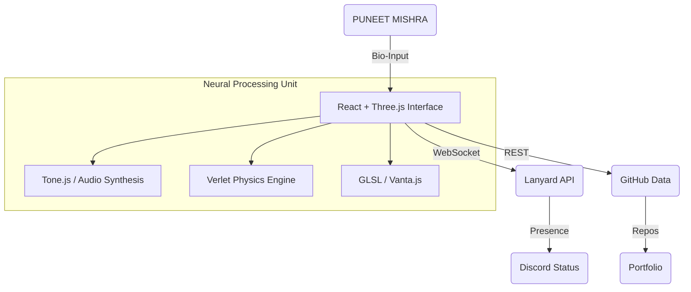

<div align="center">
    
</div>

<div id="view" align="center">
    <!-- VIEWS COUNTER -->
    
    
    <br/>
    
    <!-- TYPING SVG -->
    <a href="https://git.io/typing-svg">
        
    </a>
</div>

<br/>

<div align="center">
    <table>
        <tr>
            <td width="66%" valign="top">
                
            </td>
            <td width="33%" valign="top">
                <!-- STREAK STATS (From User Snippet) -->
                <a href="https://github.com/pyouneetm">
                    
                </a>
            </td>
        </tr>
    </table>
</div>

## 🧬 COGNITIVE ARCHITECTURE & BIO-METRICS



<div align="center">
    
</div>

### :hammer_and_wrench: Languages and Tools :
<div align="center">


</div>

<div align="center">
    <table>
        <tr>
            <td width="50%">
                <h3 align="center">MOLECULAR_SKILLS</h3>
                
            </td>
            <td width="50%">
                <h3 align="center">NEURAL_SYNAPSE</h3>
                
            </td>
        </tr>
    </table>
</div>

## 🏆 ORBITAL ACHIEVEMENTS
<div align="center">
    <a href="https://github.com/ryo-ma/github-profile-trophy">
        
    </a>
</div>

## 📊 QUANTUM METRICS & CHRONOMETRY
<div align="center">
    <table>
        <tr>
            <td width="50%">
                <!-- WakaTime via Readme-Stats (Live) -->
                
            </td>
            <td width="50%">
                <!-- Top Langs (Live) -->
                
            </td>
        </tr>
    </table>
</div>

## 🐍 CONTRIBUTION_WORMHOLE (SNAKE_ALGO)
<div align="center">
    <!-- Uses standard action path, will only work if action is setup, otherwise broken image -->
    
</div>

## 🌟 STAR_GAZER_NEBULA
<div align="center">
    
</div>

## ⚡ RECENT_FLUX_CAPACITY
<div align="center">
    <!-- Live Activity Graph -->
    
</div>

## 📡 COMMAND CENTER (SOCIAL UPLINKS)
<div align="center">
    <a href="https://github.com/Pyouneetm"></a>
    <a href="https://www.linkedin.com/in/pyouneetm"></a>
    <a href="https://www.instagram.com/pyouneetm"></a>
    <a href="https://twitter.com/pyouneetm"></a>
    <a href="https://www.youtube.com/@pyouneetm"></a>
    <a href="https://www.reddit.com/user/pyouneetm"></a>
    <a href="https://discord.com/users/742458064923459675"></a>
</div>

<br/>

## 🧪 EXPERIMENT: COSMIC DODGE (PHYSICS CORE)
> *A high-velocity survival simulation leveraging verlet integration and separating axis theorem.*

<details>
<summary><b>[ ACCESS SOURCE KERNEL ]</b></summary>

```javascript
// PHYSICS INTEGRATION LOOP
update(dt) {
    this.entities.forEach(e => {
        if(e.type === 'ENEMY') {
            // Apply force vectors & gravity
            e.pos.y += e.vel.y * dt;
            
            // Calculate distance magnitude (Euclidean)
            const dx = this.player.pos.x - e.pos.x;
            const dy = this.player.pos.y - e.pos.y;
            const dist = Math.sqrt(dx*dx + dy*dy);
            
            // Event Horizon Singularity Check
            if(dist < 20) this.triggerSingularity();
        }
    });
}
```
</details>

<div align="center">
    <p><i>"The most incomprehensible thing about the universe is that it is comprehensible." - Albert Einstein</i></p>
    <br/>
    
</div>
